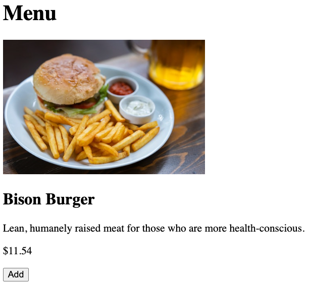

# Drawing HTML
<!-- Time: 20min -->
We’ve got some components created and are able to display them one by one. But they’re pretty boring so far because there’s nothing in them. Let’s fix that in this lab by putting some JSX to draw something more interesting.

## Writing one from scratch

1.	Make `<Login>` the component that is being displayed in App.js.
2.	Edit Login.js. Change the `<h1>` you added earlier to say, “Log in”.
3.	Underneath the `<h1>`, add an `<input id="username">` with a `<label htmlFor="username">` The label should say "Username".
4.	Add another `<input>` with a `<label>` for "Password".
5. Add a button that says "Log in".
6.	Add a link to: `/register` with the text of “Register”
Note: This link will not actually work yet so don't expect it to.
7.	If you’re not already running your project, please do. Make sure your component renders in the browser.  (Hint: don’t forget that you must have a single root node in your JSX.)


## Implementing the JSX for Menu.js
Writing one of these from scratch was good practice but this isn’t a course about HTML so rather than have you write a bunch of HTML, we’ve written it for you. You’re going to simply put the prewritten JSX in your components.

8.	Edit App.js and make `<Menu>` the component being shown.
9.	Now edit Menu.js. Remove the few lines of JSX that you wrote in the earlier labs and replace it with the contents of Menu.starter.jsx which you’ll find in the starters folder we’ve provided for you.

In other words, find this:
```javascript
  return (
    <>
      <h1>Menu</h1>
      {menuItem.name}
    </>
  )
```
And replace it with what's in `Menu.starter.jsx`.

10.	Run and test. Correct any problems you might have in the transpiling and the running. You should be seeing a menu item with a picture, name, description, price, and an 'Add' button.


## Finishing off the rest
Now that you’ve implemented the JSX for Menu, do the same for the rest.

11. Start with Orders.js. Find Orders.starter.jsx and copy its contents in place of the existing `return (` statement.
12. Next do Order.js.
13. And finally, do Cart.js.

You can ignore linter warnings for now. If there are minor JavaScript errors like variables that are not declared, go ahead and fix them.

We’ve got some great content now. But it isn’t very pretty because we haven’t styled it. Don’t worry. We'll get to that eventually.
