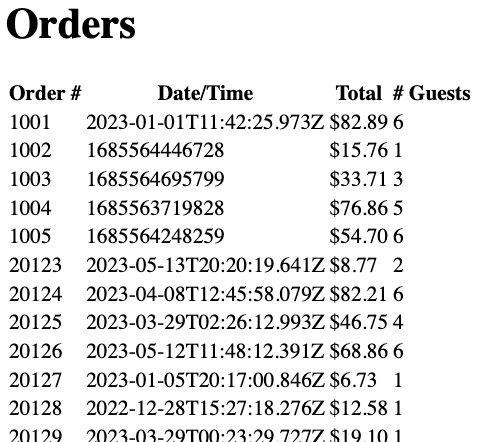

# Drawing lists
<!-- Time: 20 minutes -->

## Showing all the menu items
You've seen how we are showing one menu item on the page. But there are many items! Let's show them all by iterating them with `map()`.

1. Edit Menu.js. Find where it says this.
```JavaScript
<h1>Menu</h1>
<section id="itemsWrapper">
  <section>
    <div>
```
and change it to say this
```JavaScript
<h1>Menu</h1>
<section id="itemsWrapper">
  {menuItems.map(menuItem => <section key={menuItem.id}>
    <div>
```

2. Find the closing `</section>` line that matches your map()ped `<section>`. It should be about 12 lines below. Put a `)}` after it.

3.  Run and test by looking at http://localhost:3000/. If you've got it right, you should see a whole bunch of menu items instead of just the one.

## Showing all the orders
We have the same situation in Orders.js. There's only one order showing. Let's see if you can show all the orders with fewer instructions.

1.  Edit Orders.js. Find the `<tr>` that need to be repeated. Wrap it in a `map()` function and use expressions (hint: use curly braces) to display the orderId and orderTime.

2.  Run and test. Got those two? Cool. 

3.  Double-check that you remembered to add a `key` to the `<tr>`.

Notice that you have two columns that still must be evaluated, order total and number of diners.

4.  Import these at the top of Orders.js
```JavaScript
import { getOrderTotal, getNumberOfDiners } from "./utilities";
```

5.  Put thes columns in the `<tr>` you're map()ping:
```JavaScript
<td>{getOrderTotal(order)}</td>
<td>{getNumberOfDiners(order)}</td>
```

6.  Run and test. You should see something in all four columns and if you click/tap on an order, you should navigate to the Order view for that particular order.



Nice! You did it for the orders, now let's do it for the menu items on a single order.

## Order.js
If you look at Order.js, you'll see that we are gathering all the lines of the order but we're only showing placeholders in a `<tr>`. That `<tr>` should be repeated once for each orderItem in the order.

1.  Edit Order.js. Find the `<tr>` that should be repeated.

2.  See if you can figure out how to `map()` over the rows, interpolating all the values. 

3.  Bonus!! While we're here, display all the remaining order data. First `import { getOrder, getMenuItem, getMenuItems, getNumberOfDiners, getOrderTotal } from './utilities';` then use those functions in expressions. Display the other pieces of data as well, like customer's userId, credit card pan, location, order time, and so on.

If you need some hints, here's a solution:
<details>
<summary>Click to show a possible solution</summary>

```html
<h2>Order {orderId}</h2>
<p>Customer: {order?.userId}</p>
<p>Number of guests: {order && getNumberOfDiners(order)}</p>
<p>Credit card: {order?.creditCard.PAN}, expiry: {order?.creditCard.expiryMonth}/{order?.creditCard.expiryYear}</p>
<p>Location: {order?.location}</p>
<p>Order time: {order?.orderTime.toLocaleString()}</p>
<table>
  <tbody>
    {order?.items.map(item => (
      <tr key={item.cartItemId}>
        <td>{getMenuItem(item.itemId)?.name}</td>
        <td>{item.price}</td>
        <td>(for {item.firstName})</td>
      </tr>
    ))}
    <tr><td>Tax</td><td>{order?.tax}</td></tr>
    <tr><td>Tip</td><td>{order?.tip}</td></tr>
    <tr><td>Total</td><td>{order && getOrderTotal(order)}</td></tr>
  </tbody>
</table>

```
</details>
