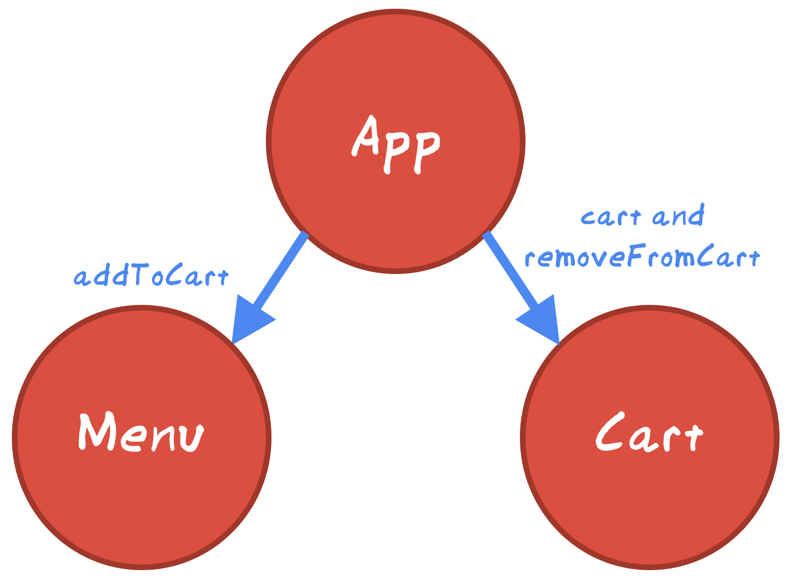

# Props
<!-- Time: 15 minutes without the bonus. 20 with -->
Note: As you create props, you may see linter warnings that look scary but really aren't. If they bother you, turn the "react/prop-types" rule off, [here's how](../../cheatsheet.md#ignoring-rules-across-the-entire-project).

A "cart" object holds the items being purchased, right? A customer *adds* to the cart in Menu.jsx because that's where the Add To Cart button is. You and I *read* from it in Cart.jsx. Thus, the cart object is needed in two places (Menu.jsx and Cart.jsx). To have it shared in two or more subcomponents, we must lift it up to a higher React component. This is why we put it in App.jsx.

<!-- Diagram of the two components -->


## Displaying the cart
The cart state variable is in App.jsx. We'd like to display it in the Cart component so we need to pass it from App into Cart.

1. Let's prepare Cart to receive props first. Change it to take in props:
```JavaScript
export function Cart(props) {
  const cart = props.cart;
```

2. Obviously you'll want to delete the test cart you added earlier. Go ahead and do that now.

You've now got a real cart with some items. Let's iterate them.

3. Find the `<section className='cartItems'>`. Using `cart.map()`, repeat this section once for each item in your cart. Don't forget your key.

4. Edit App.jsx. Pass the cart down into Cart as a prop. Change this:
```HTML
<Cart />
```
to this:
```HTML
<Cart cart={cart} />
```

5. Run and test. If there were items in your cart, you could see them here. 

Let's make our app able to load items into the cart.

## Adding to the cart
A few labs ago, you made the *Add* button on the Menu component call a local function. Let's make that function actually add to the cart.

But there's a challenge. The cart state object is up in App.jsx. We can't pass the item from down here in Menu up to App because data cannot flow **up** from a child component to the parent.

We can pass a function down, though!

1. Change Menu.jsx, adding a props parameter.
```JavaScript
export const Menu = (props) => {
  const addToCart = props.addToCart;
```

2. This will be a problem because of the test function we added earlier. So find the `addToCart` function you added in an earlier lab and just delete it.

3. Go back to App.jsx and pass addToCart down to Menu like this:
```HTML
<Menu addToCart={addToCart} />
```

4. Run and test. Each time you click the Add button on any item and then visit the Cart, you'll see your new item.

## Removing an item from the cart
We have a similar issue in the Cart component. It has a button to remove each item from the cart. We've got to pass the `removeFromCart` function down from App to Cart.

1. Go ahead and do that. Pass `removeFromCart` down from App.jsx to Cart.

2. Also read it in props in Cart.jsx.
```JavaScript
const removeFromCart = props.removeFromCart;
```

3. lastly, call it. Find the remove from cart button and call removeFromCart.
```HTML
<button onClick={() => removeFromCart(cartItem)}>Remove</button>
```

4. Run and test. See if you can click on the remove button and have it actually remove items.

## Bonus! Decomposing

If you have extra time, try this. We're going to decompose Menu.jsx into a subcomponent called MenuItem.jsx. Each MenuItem component will be responsible for drawing one (1) menu item.

1. Open Menu.jsx and find where you're iterating the menu items. Extract the menu item into its own component called MenuItem. 

2. Create a MenuItem.jsx component. It should receive `menuItem` and `addToCart` in its props.

3. Cut the JSX for the menu item out of Menu.jsx and paste it into MenuItem.jsx.

4. If you see any functions that were imported in Menu.jsx that are needed in MenuItem.jsx, do the import there as well. (Hint: toCurrency is probably needed).

5. `import { MenuItem } from "./MenuItem";` at the top of Menu.jsx

6. Find where you cut the `<section>` out of the JSX and replace it with MenuItem like this:
```JavaScript
{menuItems.map(menuItem => <MenuItem menuItem={menuItem} addToCart={addToCart} key={menuItem.id} />)}
```

This says to iterate the menuItems and draw one MenuItem for each one.

7. Run and test. You should see no difference from before but your code is much simpler now.