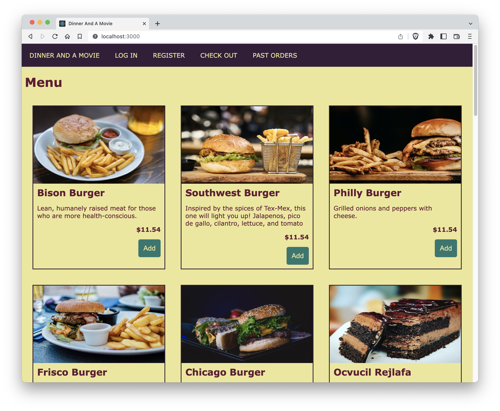

# Styling inside a component
<!-- Time: 15 minutes -->

This lab is all about aesthetics! Your opinions about looks may differ. Don't be constrained to follow our instructions exactly. Feel free to change the structure of the Menu component to make it layout however you decide.

## Making the menu items look nice

1. Add a new object to your code in Menu.js.
```JavaScript
const styles = {
  wrapper: {
    display: "flex",
    flexWrap: "wrap",
    flexDirection: "row",
  },
};
```
2. In Menu.js, make this ...
```HTML
<section id="itemsWrapper">
```

look like this:
```HTML
<section style={styles.wrapper} id="itemsWrapper">
```

We just applied a style to `<section>` that encloses each menu item. You may have seen a slight change when you saved Menu.js. Now let's finish this off in MenuItem.js.

3. Add a styles object to MenuItem.js:
```JavaScript
const styles = {
  itemCard: {
    flex: "1 0 250px",
  },
  image: {
    width: "100%", height: 200,
    backgroundSize: "cover",
  },
  itemName: {},
  description: {},
  price: {},
  addButtonContainer: {},
};
```

4. Add a `style` property to the `<section>` element:
```HTML
<section style={styles.itemCard}>
```

5. Refresh it. See the change in layout?

6. Add a `style={styles.image}` to the ``. Again, refresh and examine.

7. Put some margin between the cards. (Hint: add a `margin` property to the itemCard style object).

8. Do the same with a border.

At this point you can begin getting creative. We'll give you less instruction.

9. Add styles in the styles object and in the JSX that you think need it.

Maybe let this be a goal:


Obviously you'll need to lean on your CSS skills to do this. If you don't know CSS well, here is a [cool cheatsheet](https://htmlcheatsheet.com/css/).

